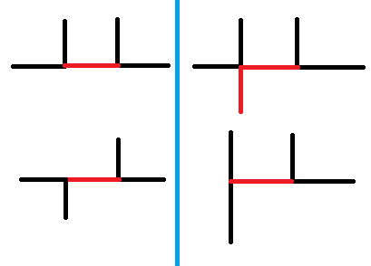

# 监狱(jail)

由于这题是棵树，同时每一个人走的都是最短路，这也就意味着不会出现通过好多个人一起的挪动来匀出空间。
所以如果合法，必然存在一种方案是每一次直接将一个人挪到终点。
由此，对于一个人 $(S_i,T_i)$ 来说，起点在他的路径上的人必然在他之前移动，终点在他的路径上的人必然在他之后移动。这个偏序关系可以使用树剖+线段树优化建图来做到。
然后拓扑排序一遍判断是否有环即可，时间复杂度 $O(n\log^2n)$。

# 图(graph)

首先考虑 $k=\left\lceil\dfrac{m}{n-1}\right\rceil$ 的含义，将 $m$ 条边至多 $n-1$ 个分成一组，则边将会分成至少 $k$ 组。

而 $n-1$ 条边分一组，容易让人联想到生成树，而对于一个生成树，其上的每一对点 $u,v$ 之间有且仅有一条路径。

同时维护 $k$ 张图，依次尝试加入每一条边 $(a_i,b_i)$：

从第一张图中开始尝试，如果当前这张图中 $a_i,b_i$ 已经联通了，那么就枚举下一张图；否则将这条边加入当前的图中。如果 $k$ 张图中均联通了 $a_i,b_i$，说明已经能够得到一组答案，当前这条边可以不加入了。

使用并查集维护连通性，时间复杂度为 $O(mk\alpha(n))$ 的，在 $m$ 很大，$n$ 很小的时候并不能接受这个复杂度。

根据上面的构造方法，如果在第 $j$ 张图中 $a_i,b_i$ 已经联通了，那么就说明第 $1\sim j$ 张图中 $a_i,b_i$ 都已经被联通了。所以可以通过二分来确定最早的 $a_i,b_i$ 没有联通的图。

时间复杂度 $O(m\log k\alpha(n))$。

# 逃跑路径(route)

首先答案必然有一个上界 $S\times n-T_i$，也就是把第一天等完，然后一天走一条边。

我们考虑一个人可能走的两种情况：

1. 在一天之内完成了整个路程。
2. 用至少两天完成了整个路程。

### 第二种情况

对于第二种情况，我们可以将其分解成三段：第一天，中间的若干天（可能没有），最后一天。我们逐个来考虑。

#### 第一天

考虑路径 $U\to V$。我们可以倒过来看：初始权值为 $S$，从 $V$ 点走到 $U$ 点，经过了第 $i$ 条边，权值会变成 $\min(S,C_i)-L_i$，我们要最大化最后的权值。

这个过程类似最短路可以使用 Dijkstra 实现，以每一个点为起点跑一遍，时间复杂度 $O(nm\log m)$。由于这个图是稠密图，所以 Dijkstra 单次可以做到 $O(n^3)$。

#### 最后一天

考虑路径 $U\to V$。这个和正常的最短路是类似的，但是只有转移权值 $\le C_i-L_i$ 才能沿着第 $i$ 条边转移。

这个也可以使用 Dijkstra 实现，以每一个点为起点跑一遍，时间复杂度 $O(nm\log m)$ 或者 $O(n^3)$。

#### 中间的若干天

每一天都可以看作是一条和“最后一天”相同的路径，利用最后一天对应的数组来生成一张图：如果可以从 $U$ 到达 $V$，则我们加入一条 $U\to V$ 的权值为 $S$ 的边。

然后在这张图上跑 Floyd 即可，时间复杂度 $O(n^3)$。

考虑如何计算对于答案的贡献，一个很暴力的想法是枚举第一天的终点 $U'$ 和最后一天的起点 $V'$，判断第一天 $U\to U'$ 的合法性，然后把三段的贡献加到一起。但是这样单次的复杂度为 $O(n^2)$ 无法接受。

我们考虑到 $V'$ 的枚举是只与 $U'$ 和 $V_i$ 有关的，与 $U_i$ 和 $T_i$ 无关。所以我们预处理对于每一个 $U'$ 和 $V_i$ 的 $V'$ 的枚举，这样在求解的过程中只需要枚举 $U'$ 即可。单次求解时间复杂度为 $O(n)$。

### 第一种情况

我们考虑一条从 $T=0$ 时刻开始的，合法的从 $U$ 到 $V$ 的路径，每次必然是能走就走，我们逐渐的增大 $T$，直到某一个时刻 $T=T'+1$ 时，有一条路是不可经过的了。也就是至多在 $T'$ 时刻出发，才能够走这一条路径。我们考虑限制住这条路径的是编号为 $x$ 的边，则从 $T'$ 时刻出发，必然会在 $C_x-L_x$ 时刻到达 $A_x$ 或 $B_x$，再在 $C_x$ 时刻到达这条边的另一端。

我们考虑枚举这条边 $x$，则可以将所有这样的路径拆成两部分（假设从 $A_x$ 进入这条边，从 $B_x$ 离开这条边，反过来也是类似的）：第一部分是从 $U\to A_x$，在 $C_x-L_x$ 时刻到达 $A_x$，这个可以和第二种情况中的“第一天”类似的方式处理；第二部分是 $B_x\to V$，从 $C_x$ 时刻出发，这个可以和第二种情况中的“最后一天”类似的方式处理。

对于某一对 $U,V$，假设我们得到至多在 $T_1$ 时刻从 $U$ 出发，可以在 $T_2$ 时刻到达 $V$，则如果要走 $U\to V$，且可以在 $\le T_1$ 的时刻出发，就可以以 $T_2-T_1$ 的代价走到。

对于每一对 $U,V$，都可以得到这样的 $O(m)$ 条路径，将其按照 $T_1$ 排序，去掉所有被其他路径偏序了的路径，就可以通过一次二分来得到每一次询问能否在第一天之内到达，同时可以得到它需要消耗的最短时间。

考虑时间复杂度：对于枚举每一条边跑一次 Dijkstra，时间复杂度为 $O(mn^2)$；对于每一个 $U\to V$ 点对处理那 $O(m)$ 条路经，时间复杂度 $O(n^2m\log m)$；每一次求解答案需要一次二分，时间复杂度 $O(Q\log m)$。

总体时间复杂度为 $O(n^2m\log m+Q(n+\log m))$ 可以通过。

# 矩形覆盖(rect)

将黑色的部分看作一个大的图形，那么就是要将图形分割成尽可能少的部分，使得每一个部分都是一个矩形。

现在的主要问题是如何描述当前的图形是否已经被分割成了若干个矩形。

在所有边界均与横轴或纵轴平行的图形之中，只有矩形是仅包含 $90^\circ$ 内角而不包含 $270^\circ$ 内角的。因此，如果能够将初始图形通过若干次切割，使得其中仅包含 $90^\circ$ 内角，也就说明将图形分割成了若干个矩形。

同时，假设内角数量为 $d$，可以直接确定矩形的数量为 $\dfrac{d}{4}$，这也方便我们最小化矩形数量。

而对于 $270^\circ$ 内角的分割形式也很简单：将其分成一个 $90^\circ$ 内角和一个 $180^\circ$ 内角（等价于普通边）。

具体的分割也会有两种情况：
* 通过一次分割将两个 $270^\circ$ 内角一起分割（对应下图左侧）。
* 通过一次分割只将一个 $270^\circ$ 内角分割（对应下图右侧）。

上面的两种分割方式中：
		
* 第一种能够减少 $2$ 个 $270^\circ$ 内角，产生 $2$ 个 $90^\circ$ 内角；
* 第二种能够减少 $1$ 个 $270^\circ$ 内角，产生 $3$ 个 $90^\circ$ 内角。
		
假设原图有 $N_1$ 个 $270^\circ$ 内角和 $N_2$ 个 $90^\circ$ 内角，有 $t$ 个第一种分割，那么就还有 $(N_1-2t)$ 个 $270^\circ$ 角使用的是第二种分割。

那么最终的 $90^\circ$ 内角数量就等于 $N_2+2\times t+3\times (N_1-2t)=N_2+3N_1-4t$，最小化内角数量就是最大化 $t$。

所以希望能够尽可能多的构造第一种分割。而第一种分割需要对 $270^\circ$ 的角进行匹配，尝试从匹配的角度思考这个问题。

每一个 $270^\circ$ 内角，向着其可能的两条分割线方向延申，如果能够到达另一个 $270^\circ$ 内角，那么就说明这是一组可行的匹配。
		
如果两条可能的匹配的分割线线相交了（包括端点），那么这同时选择这两条分割线，会有一个分割等价于两个第二种分割。因此，如下图这些有相交的分割线是不能同时选择的。

将每一对匹配看作点，将冲突关系看作边，选取尽可能多的匹配就是选择最大独立集。

但是由于横向的分割线只会和纵向的分割线相交，所以这张图是一个二分图。二分图最大权独立集大小=点数-最小点覆盖大小，而最小点覆盖大小=最大匹配大小=最小割大小，直接建图跑网络流即可。

由于可能的匹配数和冲突数都是 $O(NM)$ 的，因此使用 Dinic 的时间复杂度即为 $O((NM)^{1.5})$。