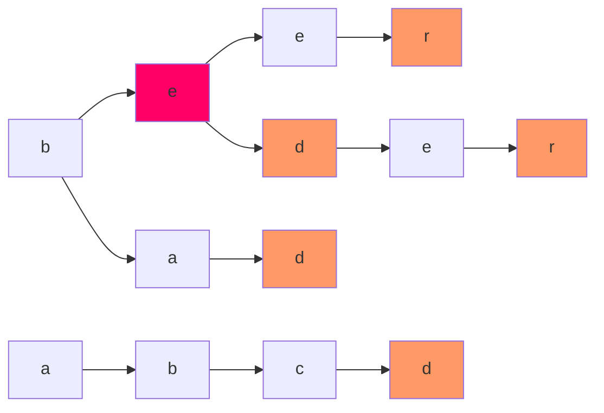
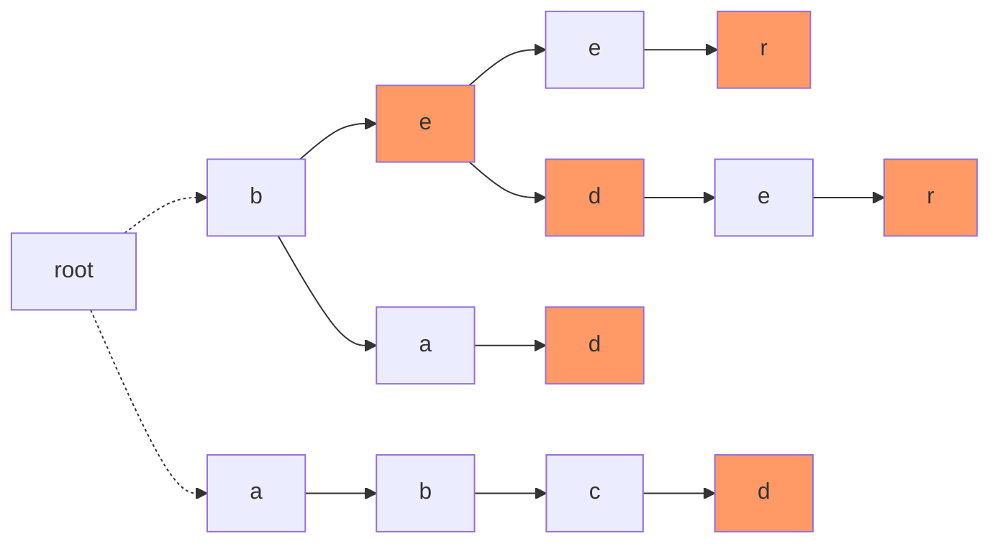
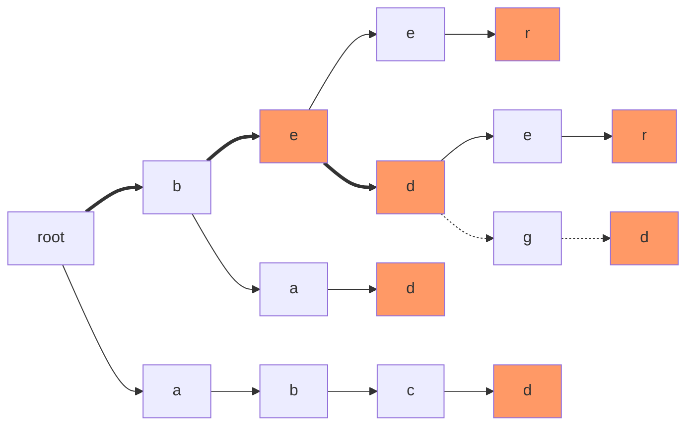

---
熟练度:
  - t2
---
## 基本介绍

字典树，就是将字符组成一棵树，方便如查询等各种操作
例如以下几个字符串

```
beer
be
bed
beder
bad
abcd
```

将会构建成这个样子



其中，前缀相等的字符将会合并在一起，方便查询

## 如何构建

### 节点

我们可以声明一个结构体 `node` 来存储字典树的节点信息

```cpp
struct node{
	char this_ch;
	bool if_end;
	//或 int if_end;
	node* next_node[27],*father_node;
	node(){
		this_ch='\0';
		if_end=false;
		//或 if_end=0;
		father_node=nullptr;
		memset(next_node,0,sizeof(next_node));
	}
};
```

其中，`this_ch` 存储此节点的字符，`if_end` 存储此节点是否为某个字符串的结尾（我们也可以定义此变量为 `int` 类型来存储他作为结尾的编号），`next_node[i]` 则指向此节点 ASCII 码值为`'a'+i`的下一个节点，`father_node` 则指向此节点的父节点，同时，为了初始化，我们还需要写一个构造函数

如上图标红的节点则可以如下表示

```cpp
node e();
e.this_ch='e';
e.if_end=true;
//或 e.if_end=2;
e.next_node['e'-'a']=&(下一个e);
e.next_node['d'-'a']=&(下一个d);
e.father_node=&(上一个b)
```
### 连接

我们现在已经有了节点，接下来就是如何将节点连在一起了
我们可以写一个如下的结构体

```cpp
struct Trie{
	node root;
	int string_cnt;
	void push_string(string str){
		//TODO
	}
};
```

其中，`string_cnt`用于统计字典树中字符串的个数，`push_string` 函数用于向字典树中加入一个字符串，而`root` 是一个 “超级源点”。他的作用在于将字典树变为一棵树，而不是一片森林
如本文开头的图加入 “超级源点” 后，长成了这个样子



这样，就方便我们构建字典树

接下来，就是如何编写 `push_string`函数了。我们只需要不断地访问与新字符串对应的节点，遇到没有的节点再新建节点即可

如下图所示，我们将用加粗的线表示遍历过的节点，虚线表示新建的节点来展示上图这棵字典树是如何插入 `bedgd` 这个字符串的



接下来是代码片段

```cpp
void push_string(string str){
	node* this_node=&root;//正在遍历的节点（初始为根节点）
	for(int i=0;i<str.size();i++){//依次检查字典树内是否有str内的字符
		if(this_node->next_node[str[i]-'a'] == nullptr){//若节点为空
			this_node->next_node[str[i]-'a']=new node()//此次使用了上文提到的构造函数 
		}
		this_node->next_node[str[i]-'a']->this_ch=str[i];
		this_node->next_node[str[i]-'a']->father_node=this_node;
		this_node=this_node->next_node[str[i]-'a']; //更改当前遍历的节点
	}
	this_node->if_end=true;
	string_cnt++;
	//或 this_npde->if_end=++string_cnt;
}
```

## 例题

> [!note]- 洛谷P8306
> # 【模板】字典树
>
>## 题目描述
>
>给定 $n$ 个模式串 $s_1, s_2, \dots, s_n$ 和 $q$ 次询问，每次询问给定一个文本串 $t_i$，请回答 $s_1 \sim s_n$ 中有多少个字符串 $s_j$ 满足 $t_i$ 是 $s_j$ 的**前缀**。
>
>一个字符串 $t$ 是 $s$ 的前缀当且仅当从 $s$ 的末尾删去若干个（可以为 0 个）连续的字符后与 $t$ 相同。
>
>输入的字符串大小敏感。例如，字符串 `Fusu` 和字符串 `fusu` 不同。
>
>## 输入格式
>
>**本题单测试点内有多组测试数据**。  
>
>输入的第一行是一个整数，表示数据组数 $T$。
>
>对于每组数据，格式如下：  
>第一行是两个整数，分别表示模式串的个数 $n$ 和询问的个数 $q$。  
>接下来 $n$ 行，每行一个字符串，表示一个模式串。  
>接下来 $q$ 行，每行一个字符串，表示一次询问。
>
>## 输出格式
>
>按照输入的顺序依次输出各测试数据的答案。  
>对于每次询问，输出一行一个整数表示答案。
>
>## 样例 #1
>
>### 样例输入 #1
>
>```
3
3 3
fusufusu
fusu
anguei
fusu
anguei
kkksc
5 2
fusu
Fusu
AFakeFusu
afakefusu
fusuisnotfake
Fusu
fusu
1 1
998244353
9
>```
>
>### 样例输出 #1
>
>```
2
1
0
1
2
1
>```
>
>## 提示
>
>### 数据规模与约定
>
>对于全部的测试点，保证 $1 \leq T, n, q\leq 10^5$，且输入字符串的总长度不超过 $3 \times >10^6$。输入的字符串只含大小写字母和数字，且不含空串。
>
>### 说明
>std 的 IO 使用的是关闭同步后的 cin/cout，本题不卡常。

对于此题，我们只关心每个节点有多少个字符串经过，因此我们不用 `node` 结构体·，只使用 `int` 类型记录每个节点的被经过次数与下一个节点即可。那么对于询问 `str` ，答案就为字符串 `str` 的末尾在字典树中的位置被经过的次数

**注意：memset耗时较大，在初始化时建议直接使用for**

代码：
```cpp
#include <bits/stdc++.h>
using namespace std;

struct Trie{
    int nexts[2000005][128]; //节点的下一个节点
    int nodes[2000005]; //对应极度简化后的 node 结构体
    int nodecnt; //记录节点开到哪里了
    void clean(){
        for (int i = 0; i <= nodecnt; i++) {
			for (int j = 0; j <= 127; j++) {
				nexts[i][j] = 0;
			}
		}
		for (int i = 0; i <= nodecnt; i++) {
			nodes[i] = 0;
		}
		nodecnt = 0;
    }
    void push_string(string str){
        int this_node = 0;
        for (int i = 0; i < str.size(); i++){ // 依次检查字典树内是否有str内的字符
            if (!nexts[this_node][str[i]]){  // 若节点为空
                nexts[this_node][str[i]] = ++nodecnt; // 将此节点的下一个节点记录为nodecnt++;
            }
            this_node = nexts[this_node][str[i]];
            nodes[this_node]++; //记录被经过次数
        }
    }
    int find_string(string str){
        int this_node = 0;
        for (int i = 0; i < str.size(); i++){
            if (!nexts[this_node][str[i]]){  // 若节点为空
                return 0; //str不可能是字典树内任意一个字符串的前缀
            }
            this_node = nexts[this_node][str[i]];
        }
        return nodes[this_node];
    }
}trie;

int main(){
    ios::sync_with_stdio(0);
    cin.tie(0);
    cout.tie(0);
    int T;
    cin >> T;
    while(T--){
        trie.clean();
        int n, q;
        cin >> n >> q;
        string tmp;
        for (int i = 0; i < n;i++){
            cin >> tmp;
            trie.push_string(tmp);
        }
        for (int i = 0; i < q;i++){
            cin >> tmp;
            cout << trie.find_string(tmp) << '\n';
        }
    }
}
```
