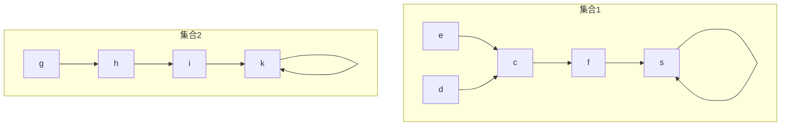
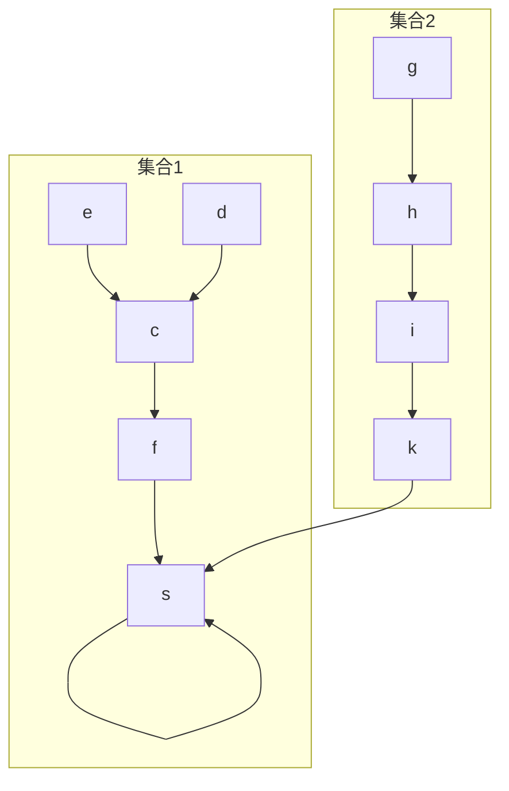

---
熟练度:
  - t3
  
---
## 介绍

并查集，与之前学的数据结构都不相同。 并查集是一种集合结构，可以理解为“散装”的图。
在并查集中，我们采用记录父节点的方式来储存节点之间的关系。特别的，根节点的父亲是他自己

如以下就是一个并查集的图形化表示



^a36aec

## 构建
### 存储
这个并查集可以用如下数组表示

| 下标  |  c  |  d  |  e  |  f  |  g  |  h  |  i  |  k  |  s  |
| :-: | :-: | :-: | :-: | :-: | :-: | :-: | :-: | :-: | :-: |
| 数值  |  f  |  c  |  d  |  s  |  h  |  i  |  k  |  k  |  s  |
### 合并
对于并查集的合并，将一个集合的根节点连向另一个集合的根节点即可


这样的改变在数组上有这样的变化

| 下标  |  c  |  d  |  e  |  f  |  g  |  h  |  i  |             k             |  s  |
| :-: | :-: | :-: | :-: | :-: | :-: | :-: | :-: | :-----------------------: | :-: |
| 数值  |  f  |  c  |  d  |  s  |  h  |  i  |  k  | $\texttt{\color{red}{s}}$ |  s  |
## 查询
并查集唯一的查询功能即是查询两个节点是否在同一集合内
实现方式非常简单，只有在祖先[^1]相同的情况下，可以说明两个节点在同一集合内

代码实现如下
```cpp
int get_father(int f){
	return ((f==father[f]) ? f : get_father(father[f]))
}

bool inone(int a,int b){
	return get_father(a)==get_father(b);
}
```


[^1]: 最终的祖先，如[[并查集#^a36aec|上图]]节点e的最终祖先为s，节点h的最终祖先为k，节点k的最终祖先为k