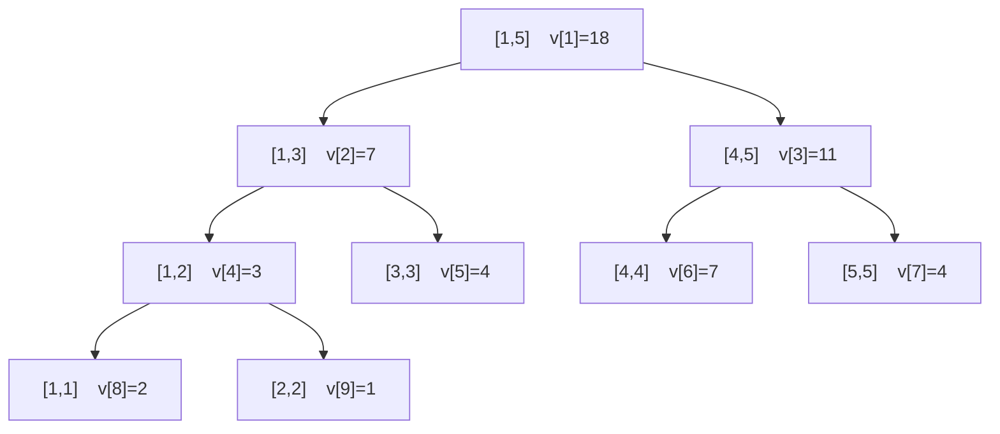
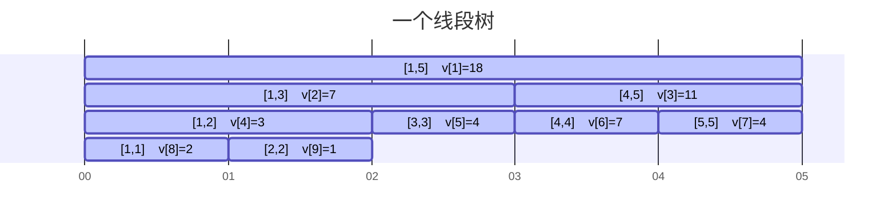

---
熟练度:
  - t1
  
---
## 介绍

线段树，就是用线段组成的树，即每个节点表示的数为 $[l,r]$ 区间内 $l\ \oplus\ l+1\ \oplus \ \dots \ \oplus\ r-1\ \oplus\ r$
的值 （其中 $\oplus$ 为任意满足结合律的运算符）

## 存储方式

若节点 $n$ 表示的区间为 $[l,r]$，则节点 $2n$ （左孩子）表示的区间为 $[l,m]$，节点 $2n+1$（右孩子） 表示的区间为 $[m+1,r]$

