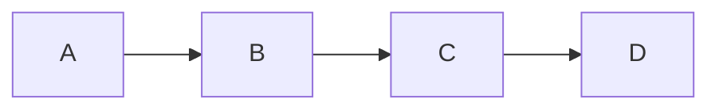
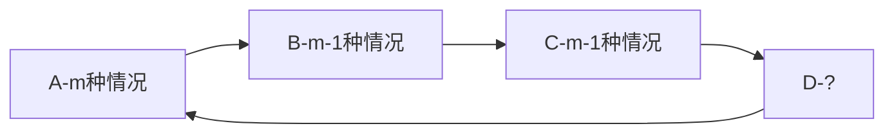
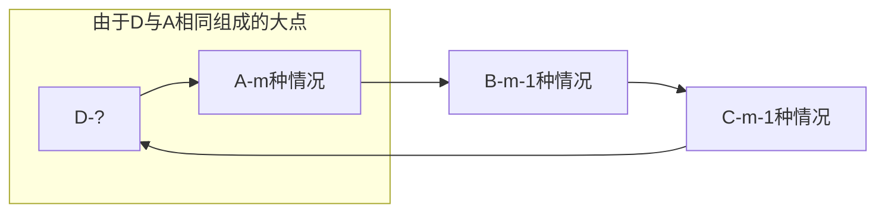

---
熟练度:
  - t2
  
---
## 圆排列

### 含义

圆排列问题，就是在一条环上进行染色，求有多少种不同的染色方案

## 例题与讲解

> 题意简述
> 小明有一个项链，项链上有 $n$ 颗珠子。现在小明有 $m$ 种颜料，问有多少种给项链上色的方式

> [!iofo] 表达方式
> 设 $a_{n}$ 为当 $m$ 已知且有 $n$ 个元素，不允许首末颜色相同时的可能性个数
> 设 ${a_{n}}^{\prime}$ 为当 $m$ 已知且有 $n$ 个元素，允许首末颜色相同时的可能性个数

如上图，这是一条链，对这条链求解十分简单，只需要去除与上一个相同的情况即可
·

但是，我们现在面对的是一条环，所以我们的头和尾就变得复杂起来了

如果我们依然以以前的方法做，那么点 `D` 与 `A` 有概率颜色一致，因为D点有两个需要考虑的”邻居“，所以我们要减去颜色一致的情况
在颜色一致时，我们可以将点 `D` 与点 `A` 视作一个点，就像这样

这样，我们可以把这个一致的情况视作 $a_{n-1}$ ，从而列出这个式子

$$
\begin{aligned}
	a_n &= {a_n}^{\prime}-a_{n-1}
\end{aligned}
$$

那这个 ${a_n}^{\prime}$ 怎么算呢？由于 ${a_{n}}^{\prime}$ 为当 $m$ 已知且有 $n$ 个元素，允许首末颜色相同时的可能性个数，所以我们可以直接写为 $m(m-1)^{n-1}$

$$
\begin{aligned}
	{a_n}^{\prime} &= m(m-1)^{n-1} \\
\end{aligned}
$$

但是 $a_n = {a_n}^{\prime}-a_{n-1}$ 这个式子是需要递归的，那递归边界在哪里呢？那就是 $n=2$ 的时候。在这时，末尾的点只需要考虑开头的点即可，也就是 $a_2=m(m-1)$

有了递归边界，我们似乎可以继续下去，直到 $n = 2$ ，如这样

$$
\begin{aligned}
	a_n &= {a_n}^{\prime}-a_{n-1} \\
		&= m(m-1)^{n-1}-a_{n-1} \\
		&= m(m-1)^{n-1}-\big(m(m-1)^{n-2}-a_{n-2}\big) \ \ \ \  \color{yellow}{从此处开始} \\
		&= m(m-1)^{n-1}-m(m-1)^{n-2}+a_{n-2} \\
		&= m(m-1)^{n-1}-m(m-1)^{n-2}+m(m-1)^{n-3}-a_{n-3} \\
		&= m(m-1)^{n-1}-m(m-1)^{n-2}+m(m-1)^{n-3}-m(m-1)^{n-4}+a_{n-4} \\
		&= \dots \\
		&= m(m-1)^{n-1}-m(m-1)^{n-2}+ \dots \pm  m(m-1)
\end{aligned}
$$

但是如此计算下去，我们无法从此得到足够简洁明了的式子。因此，我们需要在等式两边同时减 $(m-1)^n$

$$
\begin{aligned}
	a_n         &= {a_n}^{\prime}-a_{n-1} \\
	a_n-{\color{yellow}(m-1)^n} &= {a_n}^{\prime}-{\color{yellow}(m-1)^n}-a_{n-1} \\
				&= m(m-1)^{n-1}-(m-1)^n-a_{n-1} \ \ \ \  \color{yellow}{从此处开始} \\
				&= \big(m-(m-1)\big)(m-1)^{n-1}-a_{n-1} \\
				&= (m-1)^{n-1}-a_{n-1} \\
				&= -\big(a_{n-1}-(m-1)^{n-1}\big)
\end{aligned}
$$
通过以上的式子，我们可以得出一个结论 ${a_n}^{\prime}-(m-1)^n = (m-1)^{n-1}$ 。

那以上写出来的过程数据 $a_{n-1}-(m-1)^{n-1}$ 是不是长得很像 ${a_n}^{\prime}-(m-1)^n$ ？我们把它变一变就知道了

$$
\begin{aligned}
	a_n         &= {a_n}^{\prime}-a_{n-1} \\
		        &= {a_n}^{\prime}-a_{n-1} \\
	a_n-(m-1)^n &= {a_n}^{\prime}-(m-1)^n-a_{n-1} \\
				&= m(m-1)^{n-1}-(m-1)^n-a_{n-1} \\
				&= \big(m-(m-1)\big)(m-1)^{n-1}-a_{n-1} \\
				&= (m-1)^{n-1}-a_{n-1} \\
				&= -\big(a_{n-1}-(m-1)^{n-1}\big)  \\
				&= -\big({a_{n-1}}^{\prime}-a_{n-2}-(m-1)^{n-1}\big)\ \ \ \ \color{yellow}{从此处开始} \\
				&= -\big({\color{yellow}{a_{n-1}}^{\prime}-(m-1)^{n-1}}-a_{n-2}\big) \\
\end{aligned}
$$
这里的 ${a_{n-1}}^{\prime}-(m-1)^{n-1}$ 是不是几乎与 ${a_n}^{\prime}-(m-1)^n$  长得一模一样？我们就可以利用一下这个式子反复递推，直到 $n = 2$

$$
\begin{aligned}
	a_n         &= {a_n}^{\prime}-a_{n-1} \\
		        &= {a_n}^{\prime}-a_{n-1} \\
	a_n-(m-1)^n &= {a_n}^{\prime}-(m-1)^n-a_{n-1} \\
				&= m(m-1)^{n-1}-(m-1)^n-a_{n-1} \\
				&= \big(m-(m-1)\big)(m-1)^{n-1}-a_{n-1} \\
				&= (m-1)^{n-1}-a_{n-1} \\
				&= -\big(a_{n-1}-(m-1)^{n-1}\big) \\
				&= -\big({a_{n-1}}^{\prime}-a_{n-2}-(m-1)^{n-1}\big) \\
				&= -\big({\color{yellow}{a_{n-1}}^{\prime}-(m-1)^{n-1}}-a_{n-2}\big) \\
				&= (-1)^1\big({\color{yellow}(m-1)^{n-2}}-a_{n-2}\big)  \ \ \ \ \color{yellow}{从此处开始}\\
				&= (-1)^2\big((m-1)^{n-3}-a_{n-3}\big) \\
				&= \dots \\
				&= (-1)^{n-3}\big((m-1)^2-m(m-1)) \\
				&= (-1)^{n-2}(m-1) \\
				&= (-1)^n(m-1)
\end{aligned}
$$

现在，我们得到了 $a_n-(m-1)^n = (-1)^n(m-1)$，我们把 $(m-1)^n$ 加回来，就能得到正确答案了

$$
a_n=(-1)^n(m-1)+(m-1)^n
$$